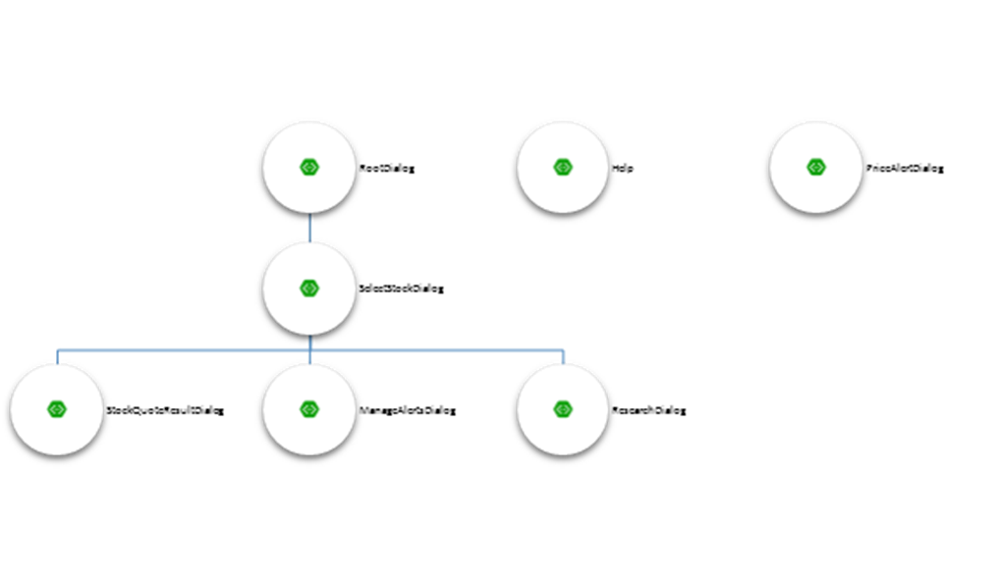
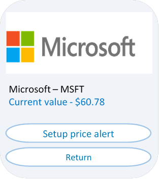

# botFramework-botSpecDocs
Proposed bot specification documents for bots designed in Microsoft Bot Framework

This is an early draft document that attempts to communicate the design of a chatbot with users and developers. 

It focuses on breaking down the logic in Dialogs. In a typical app, the developer would break down the interface into multiple screens. With bots this isn't too different: Dialogs help with the separation of concerns and navigation logic.

The document starts by demonstrating the overall navigation structure:

And then drills down into details of how each dialog operates, what inputs it expects and how data is displayed:

There are many incomplete areas, this is clearly work in progress.

Feedback and pull requests are welcome. 

